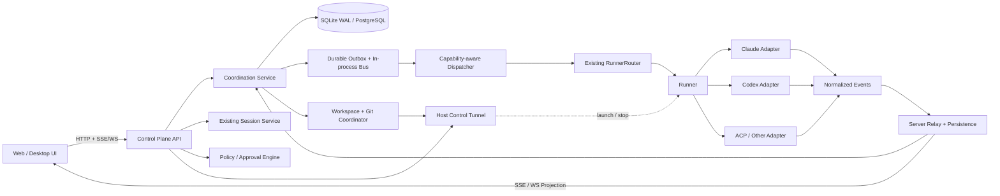

# 可视化 Coding Agent 协作控制台：二开完整计划

> 状态：In progress（按 P0–P6 门禁逐项推进，未宣布完成）
>
> 基线：Omnigent `0.12.0.dev0` 本地二开分支
>
> 制定日期：2026-08-31
>
> 内部代号：Relay（正式产品名另行决定）

## 0. 执行摘要

本项目不再把 Omnigent 仅仅当成“多个 CLI 的统一聊天前端”，而是把它二开为：

> **一个本地优先、跨产品、可观察、可治理的 Coding Agent 协作控制平面。**

用户可以在一个可视化工作台中组合 Claude Code、Codex、Cursor、Hermes、ACP Agent 和自定义 Agent；分别配置角色、Harness、模型、Provider、工作目录和 Git checkout；实时观察 Agent 之间的任务、消息、工具调用、文件修改、成本和失败原因；并在需要时进行审批、打断、转交、重试和合并。

本计划采用增量扩展，不重写 Omnigent 已有的 Server → Host/Runner → Harness 架构：

- 保留现有 Conversation、ConversationItem、Runner、Policy、SSE/WebSocket 和 Harness 适配层。
- 新增协调域：Run、Task、AgentBinding、AgentMessage、Artifact、WorkspaceLease 和 CoordinationEvent。
- 首个可用版本使用 SQLite WAL、现有 HTTP/SSE/WebSocket 和进程内调度，不引入 Kafka、NATS、Redis 或 Kubernetes。
- “实时通信”按 Harness 能力诚实降级：支持 live injection 的立即投递；不支持的进入持久队列，并在 UI 明确显示“下一轮消费”。
- 不展示或存储模型私有思维链；展示计划摘要、动作、工具、消息、产物、决策和结果。

### 0.1 推荐投入与周期

标准团队配置：

- 1 名平台/后端工程师
- 1 名 Agent Runtime/集成工程师
- 1 名前端/桌面工程师
- 0.5 名 QA/产品/DevRel

预计 24 周完成内部可分发 Windows Beta，28–32 周完成公开 Beta；前 13 周完成可用于真实项目和小范围试用的本地 MVP。

该日历假设 3 名全职工程师并行且上游同步无阻塞。若当前未提交基线未能在第 2 周通过 P0 Gate，P0 自动延长至 4 周并整体顺延，禁止一边整理基线一边启动 P1 架构重构。

单人开发应按 8–12 个月规划，并严格控制在 P0–P3，延后工作流市场、团队协作和商业化。

## 1. 背景与现状

### 1.1 上游已具备的基础

Omnigent 已经提供：

- 多 Harness：Claude、Codex、Cursor、Hermes、ACP、自定义 YAML Agent 等。
- Server、Host、Runner、Harness 子进程的分层运行架构。
- Conversation/ConversationItem 持久化、子会话、会话 Fork 和实时事件流。
- 工具调用、策略审批、沙箱、文件面板、终端、成本与用量基础设施。
- Web、桌面端和远程 Host 的基本形态。
- 模型 Provider、原生 CLI/SDK Harness 和 MCP 工具桥接。

因此，二开的正确路线是增强协调、透明度和工作区安全，而不是复制这些底层能力。

### 1.2 当前本地二开的已验证基础

当前工作树已有但尚未系统整理提交的增强包括：

- Windows 盘符和任意目录选择。
- 主工作区/worktree 可视化切换。
- Windows 绝对路径、相对路径、文件树和 Host 文件回退修复。
- Claude Partner/GPT Partner 独立模型选择。
- GPT 模型从 Gateway `/v1/models` 动态发现。
- 模型偏好向已有子会话 `model_override` 传播。
- Claude API Key Helper 跨平台化，密钥不进入命令字符串。
- Server/Host/Runner 的重连、超时和文件资源诊断增强。
- 长工具调用的 idle watchdog 续租。
- Windows 后台子进程持有输出管道导致 Shell 永不返回的问题修复。

这些修改已经构成 P0 的重要输入，但必须先拆分、提交、建立回归测试和升级策略，不能继续长期堆积在一个未提交工作树中。

### 1.3 当前真正缺失的产品能力

目前“多 Agent”仍主要表现为父 Agent 发起子会话，存在以下缺口：

- Agent 间通信关系不够显式，用户难以看到谁向谁发了什么。
- Agent 身份、Harness、模型和 Provider 在 UI 上仍容易混为一谈。
- 工具执行、Gateway 映射、重试与失败原因仍可能呈现为黑箱。
- Workspace、branch、worktree 和未提交改动缺少统一状态机。
- 没有一等 Task DAG、Artifact、Review、Handoff 和可恢复 Workflow。
- 不同 Harness 的 live steer、queue、interrupt、resume 能力差异没有统一能力模型。
- Windows 产品化、安装、升级、诊断和长时间稳定运行仍需要专项收敛。

## 2. 产品定位

### 2.1 一句话定位

让 Claude Code、Codex 和其他 Coding Agent 在同一个代码项目中透明、安全、可恢复地协作。

### 2.2 目标用户

#### A. 单人高级开发者

希望让不同 Agent 分别规划、实现、审查和测试，但不愿同时管理多个黑色终端窗口。

#### B. AI 原生小团队

希望把团队内部的 Agent 角色、模型路由、审批策略和工作流固化为可复用模板。

#### C. 平台/架构团队

希望统一治理不同 CLI、Provider、API Key、费用、工作区权限和审计记录。

#### D. Agent/模型评测者

希望在相同任务、仓库和验收条件下比较不同 Harness 和模型的真实表现。

### 2.3 核心 Jobs to Be Done

- “把这个需求交给 Claude 规划，让 Codex 实现，再让 Claude 审查。”
- “让我随时知道每个 Agent 用的真实模型、正在做什么、卡在哪里。”
- “允许两个 Agent 互相询问和返工，但不要让它们改错目录或覆盖彼此修改。”
- “一个 Agent 崩溃、电脑重启或 Gateway 抖动后，可以从可靠状态恢复。”
- “把验证有效的多人 Agent 流程保存成模板，下次一键运行。”

### 2.4 差异化

本产品不以“支持最多模型”作为主要壁垒，核心差异是：

1. **跨产品**：同一协调层连接多个真实 Coding Harness，而不是只在单一 SDK 中模拟角色。
2. **透明**：请求模型、实际模型、工具、消息、产物、成本和失败链路均可观察。
3. **工作区安全**：Agent、checkout、branch、dirty state 和写权限明确绑定。
4. **能力诚实**：不支持 mid-turn steer 的 Harness 不伪装成实时。
5. **本地优先**：代码、密钥、日志和 Agent 进程默认留在用户机器。
6. **可恢复**：每个任务、消息和工作流都有持久状态，而不是依赖一个长连接不掉线。

## 3. 目标、非目标与产品原则

### 3.1 V1 目标

- Windows 上无需打开独立终端即可完成 Claude ↔ Codex 协作闭环。
- 支持至少 Planner、Implementer、Reviewer 三种角色模板。
- 用户可以分别选择角色、Harness、模型、Provider 和 workspace。
- Agent 消息、工具调用、产物和 Git 状态进入统一时间线。
- 一个完整工作流可以暂停、恢复、重试和人工接管。
- Server/Host/Runner 重启后不丢控制面任务；不确定外部副作用进入 `effect_unknown`，核对前不自动重放。
- 错误信息可以区分模型、Gateway、Harness、工具、Host、Runner 和工作区问题。

### 3.2 明确不做

- 不读取、显示或持久化模型私有思维链。
- P0–P3 不做自由拖拽的低代码画布。
- P0–P3 不做云端多租户 SaaS。
- 不自研 IDE；文件查看、Diff、终端只服务于 Agent 协作。
- 不承诺所有 CLI 都支持完全相同的实时语义。
- 不让多个写 Agent 默认共享同一个 dirty checkout。
- 不以内置几十种“角色 Prompt”代替可靠的任务和状态协议。
- 不在 MVP 引入分布式消息基础设施。

### 3.3 产品原则

1. **事实优先**：UI 展示实际状态，不展示推测状态。
2. **可逆优先**：切换、重试、合并和清理尽量可撤销。
3. **持久化先于投递**：消息和任务先落库，再发送给 Agent。
4. **能力协商**：按 Harness capability 决定投递方式。
5. **最小权限**：每个 Agent 只获得完成任务所需的文件、工具和网络权限。
6. **人可接管**：所有自动流程都能暂停、打断、改派和手工完成。
7. **失败可解释**：任何失败至少给出发生层、原始原因、可重试性和建议操作。
8. **上游可同步**：二开尽量走扩展点和独立模块，避免无边界修改核心文件。

## 4. 标准演示场景

首个产品闭环固定为一个真实 Coding 流程：

1. 用户选择仓库和主分支，输入需求。
2. Planner（Claude）产出任务拆分和验收标准。
3. 系统为 Implementer（Codex）创建独立 worktree。
4. Planner 向 Implementer 发送 `task.request`，引用计划 Artifact。
5. Implementer 修改代码、运行测试、发布 Patch Artifact。
6. Reviewer（Claude）收到 `review.request`，只读检查 Diff 和测试结果。
7. Reviewer 发送 `review.changes_requested` 或 `review.approved`。
8. Implementer 根据结构化反馈修复并重新提交。
9. 所有验收通过后，用户点击“合并到主工作区”。
10. 系统展示完整时间线、Agent/模型映射、费用、改动和最终报告。

该场景必须在不打开外部终端、不复制粘贴上下文、不猜测 Agent 当前目录的情况下完成。

## 5. 信息架构与主要界面

### 5.1 首页

- 最近项目和活跃 Run。
- Host、Runner、Gateway 和 Agent 健康状态。
- “新建单 Agent 会话”和“新建协作 Run”两个明确入口。
- 模板：Plan → Implement → Review、并行审查、故障诊断。

### 5.2 Session Cockpit

保留聊天主视图，增加四个可切换面板：

1. **Timeline**：用户消息、A2A 消息、工具、审批、产物、Git、错误。
2. **Agents**：角色、Harness、模型、Provider、状态、当前任务、workspace。
3. **Tasks**：任务 DAG、依赖、负责人、重试和验收条件。
4. **Workspace**：文件、Diff、branch/worktree、dirty state、lease。

### 5.3 Agent Inspector

每个 Agent 明确展示：

- Role：Planner/Implementer/Reviewer/自定义。
- Harness：claude-sdk/codex/codex-native/ACP 等。
- Requested Model：用户选择的模型。
- Resolved Model：Harness 实际请求模型。
- Billed/Upstream Model：Gateway 最终映射模型（若可得）。
- Provider、Base URL、请求 ID和用量。
- 当前 Session、外部 Session ID、Host、Runner、PID。
- Workspace、branch、HEAD、读写权限。
- Capability 和降级项。

### 5.4 Communication View

- 按 Agent 分栏或按时间排列消息。
- 显示 From、To、类型、关联 Task、Artifact 和投递状态。
- 支持人工插入、改派、重发、取消和引用回复。
- 不把工具日志伪装成 Agent 消息。

### 5.5 Diagnostics

- 一键收集脱敏诊断包。
- 分层健康图：UI → Server → Host → Runner → Harness → Provider → Tool。
- 最近错误聚类、重试次数、进程树、端口和超时。
- 配置验证和“当前实际生效值”。

## 6. 目标技术架构



### 6.1 控制面与执行面

#### 控制面

负责持久状态和决策：

- Run/Task/Message/Artifact 状态。
- Agent 绑定和 Capability。
- 调度、重试、审批、预算和超时。
- Workspace lease 和 Git 操作事务。
- 事件持久化和 UI 广播。

#### 执行面

负责实际运行：

- Host/Runner 生命周期。
- Harness 子进程和 Vendor CLI/SDK。
- 工具调用和文件操作。
- 模型流式输出、Usage 和原生事件转换。

控制面不能通过进程内 Future 作为唯一事实来源；重启后必须能从数据库恢复未完成状态。

### 6.2 MVP 技术选择

| 领域     | MVP 选择                                   | 扩展条件                                          |
| -------- | ------------------------------------------ | ------------------------------------------------- |
| 数据库   | 本地参考实现使用 SQLite WAL                | 新表/migration 从第一天兼容现有 SQLite/PostgreSQL |
| 消息分发 | DB Outbox + asyncio bus                    | 多实例后换 PostgreSQL outbox/NATS                 |
| 实时 UI  | 现有 SSE + WebSocket                       | 不新增第二套前端协议                              |
| 调度     | 单 Server 进程内 Scheduler                 | 多实例时引入 leader/lease                         |
| Artifact | 复用现有 Local/S3/Databricks ArtifactStore | 只新增协调 metadata、ACL、digest 和 producer 关系 |
| 搜索     | SQLite FTS/普通索引                        | 数据量和团队需求明确后升级                        |
| 桌面     | 现有 Web/Electron 壳                       | Windows 安装包优先                                |

### 6.3 模块边界与现有代码迁移

保持模块化单体，在现有包中新增四个边界清晰的领域模块：

- `omnigent/coordination/`：MessageStore、Router、Outbox、DeliveryWorker 和 Projector。
- `omnigent/execution/`：ExecutionProfile、AgentInstance、Run 和 ProfileResolver。
- `omnigent/workspaces/`：Repo、Checkout、Lease、SwitchOperation 和 Git 事务。
- `omnigent/observability/`：Durable activity、错误归一化、诊断投影。

迁移原则：

- 现有 session stream 是低延迟进程内发布流，只继续承担在线广播；断线恢复从数据库 activity/event 游标补齐。
- 现有子 Agent 运行态和 `sys_session_send` 保持兼容，但 `sys_session_send` 改为写入新 AgentMessage/Outbox，再由 Dispatcher 投递。
- 现有 Session SSE、ConversationItem 和前端订阅由新事件投影继续供给，不要求旧客户端一次性迁移。
- 现有 SubagentsPanel、Execution Logs、worktree UI 和 Harness registry 原位演进，不重做第二套页面。
- OpenTelemetry 继续用于性能和分布式诊断；持久 Activity Log 才是产品状态与审计事实，二者不能混用。

多实例扩展优先使用 PostgreSQL outbox + LISTEN/NOTIFY 或轮询；只有确认该机制成为瓶颈后才评估 NATS JetStream，不引入 Kafka/RabbitMQ。

### 6.4 增量迁移顺序

1. M0：把当前二开拆成主题 Commit，冻结上游基线。
2. M1：定义 Capability、ExecutionProfile、AgentInstance 和事件 Schema，全部放在 feature flag 后。
3. M2：新增 durable execution event 和独立 cursor endpoint；旧 Session SSE 保持 live-only，由 Projector 双写兼容视图，避免 snapshot/live-tail 重复。
4. M3：读取旧 `subagent.model.*` labels 回填 typed profile，随后弃用 label 作为事实源。
5. M4：让 `sys_session_send` 内部改走 durable bus，再开放 typed send/reply；role/topic broadcast 延后到 P4。
6. M5：把 workspace switch 收口为后端 Operation + Lease + Rollback。
7. M6：在稳定数据上构建 Timeline、Agent Graph 和 Workflow。
8. M7：只有多 Server 副本成为现实后，增加跨实例通知层。

### 6.5 不可破坏的现有约束

- 同一 Session 的消息和工具继续按分区有序，不能因新 Dispatcher 变成并发执行。
- Runner/Host tunnel 具有副本亲和性；投递必须按持久化 `host_id/runner_id` 路由并处理 wrong-replica，不能随机发给任意 Server 副本。
- Native Terminal transcript 保持单写者；新 Event 层只记录协调/Activity，不重复持久化 Vendor transcript。
- Workspace/Git 操作仍通过拥有目录的 Host 执行，协调层不能绕过 Host 直接访问路径。
- Policy 的 fail-open/fail-closed 语义保持不变；移动工具或消息路径不能绕过 TOOL_CALL/TOOL_RESULT 检查。
- Outbox 重投只保证消息至少一次，不自动保证 Shell、Git 和外部 API 副作用可重复。

## 7. Harness Capability 模型

### 7.1 标准 Capability

每个 Harness Adapter 必须返回机器可读能力，而不是由前端按名称猜测：

```json
{
  "integration_mode": "sdk-in-process",
  "elicitation": "hook",
  "resume": "warm-reattach",
  "model_family": "claude",
  "subagents": true,
  "interrupt": true,
  "streaming": true,
  "steering": true,
  "live_queue": true,
  "fork_history": "rebuild",
  "message_delivery": "live",
  "model_switch": "next_turn"
}
```

枚举型能力必须说明语义，例如：

- `model_switch`: `live | next_turn | respawn | unsupported`
- `message_delivery`: `live | breakpoint | next_turn | terminal_best_effort`

Peer messaging 是控制面的平台能力，不是 Vendor Harness 自己声明的能力；event/usage fidelity 由 Adapter bench 和 EffectiveBinding 报告派生。

### 7.2 Adapter 契约

P2 不要求重写所有 Harness 接口。先在 Runner 上增加统一 façade，复用现有 plugin/capability registry、消息注入、interrupt、resume、model switch 和事件转换路径：

- `probe_effective_binding()`：汇总版本、登录、模型和 Capability。
- `deliver_peer_message()`：映射到现有 live injection、queue、MCP 或 terminal bridge。
- `interrupt()/resume()/switch_model()`：调用现有 Harness 实现。
- `normalize_activity()`：将现有事件投影成 Activity/ExecutionEvent。

Vendor 特有字段放在 `_meta`，不能污染通用状态机；后续只有出现真实重复代码时才提取更深 Adapter 接口。

## 8. 核心领域模型

不立即重命名现有 Conversation 表；先在 API 层明确语义并新增协调实体。

| 实体                       | 作用                                    | 关键字段                                                        |
| -------------------------- | --------------------------------------- | --------------------------------------------------------------- |
| `Conversation`             | 现有 Agent 会话/聊天和工具记录          | id、parent/root、harness、model、workspace                      |
| `CoordinationRun`          | 一次多 Agent 协作执行                   | id、template、status、owner、budget                             |
| `CoordinationTask`         | P2 的最小工作单元，P4 扩展为 DAG        | id、run_id、status、assignee、correlation                       |
| `ExecutionProfile`         | 可复用的角色执行模板                    | role、harness、model_intent、provider、policies、behavior_packs |
| `AgentInstance`            | Run 中一个真实 Agent 实例               | profile/session、status、external_session_id、consume_cursor    |
| `AgentBinding`             | AgentInstance 启动时冻结的有效配置快照  | harness、model、provider、checkout、capabilities、behaviors     |
| `BehaviorPackBinding`      | 行为包的版本化、按 Agent 配置           | pack_id、version、digest、mode、scope、injection、precedence    |
| `ExecutionAttempt`         | AgentInstance 的一次 Turn/恢复尝试      | response_id、attempt、checkpoint、started/ended、outcome        |
| `AgentMessage`             | Agent 间持久化消息                      | from、to、kind、task、correlation、message_state                |
| `Artifact`                 | 计划、Patch、Diff、报告、测试结果的引用 | id、kind、digest、uri、producer、metadata                       |
| `WorkspaceBinding`         | Repo/checkout/branch/HEAD 的事实快照    | repo_id、path、branch、head、dirty_hash                         |
| `WorkspaceLease`           | checkout 读写协调                       | checkout_id、holder、mode、expires_at、fencing_token            |
| `WorkspaceSwitchOperation` | 可恢复、可回滚的切换事务                | from/to、phase、bind_version、snapshot、error                   |
| `DeliveryAttempt`          | 面向一个目标的一次具体投递              | message/target、target_sequence、mode、injection_receipt、error |
| `CoordinationEvent`        | 不可变审计事件                          | event_id、run、task、actor、type、payload、sequence             |

### 8.1 数据边界

- ConversationItem 继续存用户/Agent 对话和工具事件。
- ExecutionProfile 是模板，AgentInstance 是运行实体，AgentBinding 是每次启动的事实快照；不得继续把模型配置仅存进 `subagent.model.*` label。
- BehaviorPackBinding 属于 ExecutionProfile/AgentBinding，不属于 Harness 全局状态；每个并发 Session 可使用不同模式。
- AgentMessage 存“谁对谁说什么”的协调语义。
- Artifact 存大内容引用；消息正文不内嵌完整 Diff、日志或二进制。
- CoordinationEvent 提供审计和时间线，不把它作为所有业务状态的唯一投影来源。
- 所有写入带 `workspace_id`/tenant partition，与现有数据库模式一致。
- P2 使用现有 `root_conversation_id` 作为 Task Room，并建立最小 CoordinationTask（id/status/assignee/correlation）；P4 只扩展 dependencies、acceptance、deadline 和调度字段，避免两次重建模型。
- AgentMessage、CoordinationEvent 和 Outbox 必须位于同一物理数据库并在同一事务提交；如果部署将 Conversation/AP 存储分离，ConversationItem 兼容投影只能 eventual + idempotent，不能宣称跨库原子。
- Artifact blob 继续交给现有 ArtifactStore；协调表只保存 metadata、ACL、digest、producer 和 store reference。

## 9. Agent 通信协议

### 9.1 协议目标

- 支持 Agent ↔ Agent、Agent ↔ User、Orchestrator ↔ Agent。
- 支持同步请求、异步任务、Review、Handoff、Interrupt 和 Artifact 发布；role/topic 广播属于 P4。
- 可持久化、可重放、可去重、可审计。
- 允许 Harness 能力降级而不丢消息。

### 9.2 `coordination.v1` 消息信封

```json
{
  "schema_version": "coordination.v1",
  "message_id": "msg_01...",
  "root_session_id": "conv_root...",
  "run_id": "run_01...",
  "task_id": null,
  "from": {
    "instance_id": "agent_01...",
    "session_id": "conv_...",
    "role": "reviewer"
  },
  "to": {
    "kind": "agent_instance",
    "instance_id": "agent_02...",
    "session_id": "conv_...",
    "role": null,
    "topic": null
  },
  "kind": "content",
  "type": "review.changes_requested",
  "correlation_id": "msg_original",
  "causation_id": "event_trigger",
  "idempotency_key": "review-task-17-attempt-2",
  "priority": "normal",
  "ttl_seconds": 3600,
  "payload": {
    "summary": "Two tests fail and the timeout path leaks a process.",
    "artifact_refs": ["art_review_01"],
    "requested_action": "revise"
  },
  "traceparent": "00-...",
  "created_at": "2026-08-31T10:00:00Z"
}
```

`to` 是判别联合：P2 只实现 `agent_instance | session`；P4 再开放 `role | topic`，并由 Server 展开为逐目标 DeliveryAttempt。

### 9.3 标准消息类型

#### Task

- `task.request`
- `task.accepted`
- `task.rejected`
- `task.progress`
- `task.blocked`
- `task.completed`
- `task.failed`
- `task.cancelled`

#### Review

- `review.request`
- `review.comment`
- `review.changes_requested`
- `review.approved`

#### Artifact

- `artifact.published`
- `artifact.updated`
- `artifact.invalidated`

#### Coordination

- `question.ask`
- `question.answer`
- `decision.proposed`
- `decision.recorded`
- `handoff.request`
- `handoff.accepted`

Envelope 的 `kind` 为 `content | command | event`：question/task/review 通常是 content，interrupt/cancel 是 command，Artifact 状态是 event。Heartbeat 只进入 Activity/Health 流，不持久化成 AgentMessage。

### 9.4 投递语义

采用 **at-least-once transport + 控制面幂等**，不宣称外部副作用 exactly-once：

1. 消息在数据库事务中写入 AgentMessage 和 Outbox。
2. Dispatcher 读取 Outbox，根据目标 Harness Capability 选择投递方式。
3. Adapter 返回 receipt 和实际 delivery mode。
4. Server inbox/Runner 在注入 Vendor Harness 前用 `message_id` 和业务 `idempotency_key` 去重；不假设 Claude/Codex CLI 自己支持幂等消费。
5. 业务动作使用独立 `idempotency_key`，避免重试重复修改文件或重复合并。

数据库状态转换可以保证幂等；Shell、Git 和外部 API 若在执行后、回执落库前崩溃，必须进入 `effect_unknown` 并人工/探测核对，禁止盲目自动重放。

消息生命周期、投递方式和消费状态分开建模：

```text
message_state:      queued | active | cancelled | expired
delivery_state:     pending | leased | injected | confirmed | failed | unknown
delivery_mode:      live | breakpoint | next_turn | terminal_best_effort | offline
consumption_state:  unconsumed | consumed | acknowledged | rejected
```

`injected` 只表示已送入 Adapter，不表示目标 Agent 已消费；只有显式 ack、镜像确认或结构化 result 才能进入 consumed/acknowledged。若 Adapter 在注入后、receipt 落库前崩溃，进入 `delivery_state=unknown`；terminal/native 不自动重投。

取消只能撤销尚未 injected 的消息；注入后只能发送 interrupt 或补充消息，不能在 UI 中伪装成已撤回。

### 9.5 顺序和并发

- 每个 DeliveryAttempt 按 `(run_id, target_session_id)` 分配单调 `target_sequence`。
- 控制面保证按目标会话有序入队，不保证跨目标全局顺序。
- P4 广播由 Server 展开为多个目标独立的 DeliveryAttempt 和 target_sequence，消息信封本身没有全局消费顺序。
- 高优先级 interrupt 可以越过普通消息，但必须记录 causation。
- 同一 Task 默认只有一个写负责人；Reviewer 不获得写 lease，无法强制只读的 Windows native 路径改用 Artifact/独立 checkout。
- 重复或迟到消息不能让已完成 Task 回退状态，除非显式 reopen。

### 9.6 “实时”的诚实定义

- UI 事件：本地 p95 < 500ms。
- 支持 live injection 的 Harness：投递 p95 < 1s。
- 仅支持 turn-boundary 的 Harness：`delivery_mode=next_turn`，UI 显示“等待下一轮消费”。
- terminal best-effort：`delivery_mode=terminal_best_effort` 且 consumption=unconsumed，直到镜像事件确认。
- Agent 离线：`delivery_mode=offline` 且 delivery_state=pending，Runner 恢复后重投。

### 9.7 Agent A → Agent B 的标准链路

1. A 通过统一工具/Adapter 请求发送消息，Harness 本身不实现消息总线。
2. Server 验证 A/B 属于允许通信的 root、ACL 和 Policy scope。
3. 同一事务写入 AgentMessage、CoordinationEvent 和 Outbox。
4. B 在线时唤醒目标 Runner；离线时保持 pending。
5. Dispatcher 按 B 的 Capability 注入 inbox，并带上来源、correlation、Artifact 引用和 delivery mode。
6. B 的 progress/result 作为新消息和事件持久化。
7. Projector 同时更新旧 Session SSE 和新 Timeline，保持现有 UI/API 兼容。

每类兼容事件只能有一个 publisher；Projector 不重复写已有 ConversationItem，Native transcript 继续由原 forwarder 单写，避免 SDK/native 双份消息。

禁止让 Claude/Codex CLI 直接建立彼此可见的私有 socket；所有跨 Agent 通信必须经过控制面的身份、权限、持久化和审计。

## 10. Task DAG 与编排引擎

### 10.1 四套状态机

```text
CoordinationRun:
draft → running ↔ paused
running → waiting_user | waiting_peer | reconciling → running
running → succeeded | failed | cancelled | needs_attention

CoordinationTask:
draft → queued → assigned → running
running → blocked | waiting_user | waiting_peer | waiting_review | reconciling → running
running → succeeded | failed | cancelled | needs_attention

ExecutionAttempt:
created → starting → running
running → waiting_user | waiting_peer | reconciling → running
running → succeeded | failed | cancelled | orphaned | effect_unknown

DeliveryAttempt:
pending → leased → injected → confirmed
injected → unknown
pending/leased → failed | cancelled | expired
```

终态不可原地回退。`reopen` 创建新的 Task revision/ExecutionAttempt，并以 causation 链接旧记录；取消与完成并发时通过 CAS 决定唯一终态。Server Coordination Service 是恢复所有者，Runner/Harness 只报告 observed state。

### 10.2 调度规则

- P4 开始，只有依赖全部 succeeded 的 Task 才能进入 queued；P2 最小 Task 没有通用依赖调度，P3 只执行固定线性流程。
- Assignee 必须在线或具备可唤醒 Host。
- 写 Task 必须先拿到 WorkspaceLease。
- 超过预算、重试次数或截止时间进入人工处理。
- Review 不自动等价于 Merge；合并保持独立审批门。
- Agent 可以建议新增 Task，但 Orchestrator 决定是否写入 DAG。

### 10.3 重试策略

错误分为：

| 类别                       | 默认行为                           |
| -------------------------- | ---------------------------------- |
| Provider 429/503、网络抖动 | 指数退避自动重试                   |
| Harness 进程崩溃           | 冷启动并尝试 resume                |
| 工具超时                   | 保留输出，允许用户重试或改为异步   |
| 测试失败                   | 回到 Implementer，不做基础设施重试 |
| Git 冲突/dirty mismatch    | 阻塞并要求人工决策                 |
| 权限拒绝                   | 不自动绕过，等待用户或终止         |
| 协议/数据损坏              | fail closed，生成诊断包            |

所有重试生成新的 attempt_id，但沿用 task_id 和 correlation_id。

### 10.4 重启恢复与不确定副作用

- 每次模型 Turn、工具和投递都写 ExecutionAttempt/checkpoint；进程内 Future 不是恢复依据。
- Server/Runner/Harness 重启后创建新 attempt，并根据现有 Harness `resume = warm-reattach | cold-only | none` 选择暖恢复、历史重放或人工确认；真实恢复质量由 bench 派生，不新增第二个 capability 字段。
- 已发出但未拿到结果的 Shell、Git、Merge、外部 API 标记为 `effect_unknown`，先探测真实状态，禁止盲目自动重放。
- 可证明只读或有幂等键的操作可自动重试；不可证明的写操作进入 `needs_attention`。
- 待审批状态、决策和过期时间持久化；重启后重新建立等待或消费已记录决策，不能依赖旧 Harness Future。
- 持久化 inbox consume cursor 和 PendingInteraction；恢复期间 AgentInstance/ExecutionAttempt 可进入 `reconciling | orphaned | effect_unknown | needs_attention`。
- 每个 AgentInstance 保存 `last_consumed_target_sequence`、Vendor turn/session ID 和最后 injection receipt；暖恢复先核对 Vendor transcript，无法确认是否已注入时进入 `delivery_state=unknown`。
- Dispatcher 对积压设置背压、最大重试和 dead-letter/needs-attention 队列，不能无限热循环。

## 11. Role、Harness、Model、Provider 解耦

UI 和数据库必须停止把“GPT Partner”“Claude Partner”同时当作角色和模型。

### 11.1 AgentBinding 示例

```json
{
  "role": "implementer",
  "harness": "codex",
  "model_request": "hy4-preview",
  "provider_id": "gpt-lan-gateway",
  "workspace_binding_id": "checkout_feature_123",
  "reasoning_effort": "high",
  "behavior_packs": [
    {
      "id": "lean-engineering",
      "version": "1.0.0",
      "digest": "sha256:...",
      "mode": "lean",
      "inherit_to_subagents": false
    }
  ]
}
```

### 11.2 模型事实链

每次 Turn 记录三个值：

1. `requested_model`：用户/工作流选择。
2. `resolved_model`：Harness 实际发送给 Provider 的模型。
3. `upstream_model`：Gateway 最终映射/计费模型（可获取时）。

任何一层未知都显示 Unknown，不从模型名字符串猜测。

### 11.3 模型发现

- 优先读取 Provider/Gateway 的实时模型列表。
- 原生 CLI 使用其官方 discovery 接口。
- 静态 fallback 必须集中管理，包含来源、Owner 和过期说明。
- 工作流模板可以使用 `fast/balanced/powerful` intent，运行时解析。
- 显式用户选择优先于 intent，但必须通过 Harness compatibility 校验。

### 11.4 Behavior Pack 与 Lean Engineering

Behavior Pack 是 Role、Harness、Model、Provider、Workspace 之外的独立执行维度，用于统一约束“Agent 如何完成工程任务”。首个第一方参考包为 `lean-engineering`：参考 YAGNI、复用优先、标准库/平台优先和最小正确 Diff 等通用原则独立编写，不复制第三方 Skill 原文、Hooks、代码、测试、Logo 或 Benchmark 宣传数据。

#### 模式

| UI 模式     | 内部值     | 行为                                      |
| ----------- | ---------- | ----------------------------------------- |
| Normal      | `off`      | 不附加精简行为                            |
| Advisory    | `advisory` | 完成需求，同时提示更简单选项              |
| Lean        | `lean`     | 默认执行最小正确实现阶梯                  |
| Strict Lean | `strict`   | 更强 YAGNI，仅适合明确授权的实现/删减任务 |

推荐角色默认值：

| 角色                 | 默认行为                |
| -------------------- | ----------------------- |
| Planner              | `advisory` 或 `off`     |
| Implementer/Fixer    | `lean`                  |
| Correctness Reviewer | `off`                   |
| Lean Reviewer        | 独立 `lean-review` 节点 |
| Test/Security Agent  | `off`                   |
| 全仓复杂度检查       | 人工触发 `lean-audit`   |

固定优先级：

```text
用户明确要求
  > 安全、权限与数据保护
  > Workflow 节点契约和验收证据
  > Behavior Pack
  > Agent 默认习惯
```

Behavior Pack 不得省略 AgentMessage 协议字段、Artifact、错误详情、投递状态、测试证据、安全检查、信任边界验证或可访问性要求。Lean Review 只检查过度设计，不能替代正确性、安全和性能 Review。

#### Harness 投递

- `instruction_delivery=composed-per-turn`：下一轮通过统一 Prompt Composer 注入。
- Session snapshot/startup 类型：更新后提示 respawn，不能假装热切换成功。
- Native Harness：使用 Session-scoped plugin/bundle 或 developer instructions，禁止共享全局 mode 文件。
- 仅支持 MCP Prompt 的 Harness：作为手工/降级路径，并显示 `injection_unconfirmed`。

每个 Turn 记录 requested pack、resolved version/digest、mode、实际注入渠道、injection receipt、冲突/降级原因和对应 Workflow 节点。目标 Agent 使用自己的 Binding，不从消息发送者隐式继承 Behavior Pack。

#### 第三方 Ponytail 兼容

- P0 可手工安装固定版本做 A/B 实验，不进入可靠性关键路径。
- 若用户显式选择外部 Ponytail Pack，固定 tag/commit/digest，并保留其 MIT License 与来源记录。
- 产品默认分发的是独立编写的 `lean-engineering`；不运行 GitHub 最新分支的第三方 Node Hook，不修改用户全局 Claude/Codex 配置。
- 第三方 Benchmark 只作为实验方法参考；收益必须在本产品、目标模型和 Demo 仓库重新测量。

## 12. Workspace 与 Git 协调

### 12.1 核心概念

- `Repo`：由 Git common dir 或显式非 Git root 唯一标识。
- `Checkout`：主工作区或一个 worktree 的绝对路径。
- `WorkspaceBinding`：Agent 与 Checkout 的绑定事实。
- `WorkspaceLease`：对 Checkout 的读/写使用权。

### 12.2 Checkout 状态

```text
availability: online | offline | quarantined
lease:        none | read | write | stale
activity:     idle | busy | quiescing
git_state:    clean | dirty | conflicted | drifted
```

四个维度正交存储，UI 才能表达 `online + write + busy + dirty` 等真实组合；安全判断读取原始字段，不依赖一个合成字符串状态。

### 12.3 可恢复切换 Saga

每次点击切换只向后端提交一个 `WorkspaceSwitchOperation`，禁止前端自行串联“释放 Runner → 再启动 Runner”。操作状态为：

```text
preflight → waiting_idle → quiescing → old_tree_verified → old_lease_released
→ target_lease_acquired → binding_committed → launching → probing → completed
                    └→ failed → rolling_back → rolled_back / recovery_required
```

Saga 持久化 `desired_binding`、`observed_binding`、每阶段时间和补偿结果，并执行：

1. 规范化并验证绝对路径。
2. 确认目录存在且属于目标 Repo。
3. 获取 branch、HEAD、dirty、untracked 和 active process 快照。
4. 如果当前 Agent 正在执行写工具，拒绝切换或先 interrupt。
5. dirty checkout 需要明确确认，不隐式 reset/checkout。
6. 将旧 lease 标记 stale 并要求 Host reconcile；休眠或 lease 过期不能直接把写权转给新 Runner。
7. 确认旧进程树退出后释放旧 lease，再获取目标 lease。
8. 递增 `bind_version` 并更新 Conversation/AgentBinding；受控工具/沙箱拒绝旧版本。
9. 使文件、Changes、终端和搜索缓存失效。
10. respawn Harness，并验证新 cwd、binding version 和 lease。
11. 将前后快照写入 CoordinationEvent。
12. 任一步失败按已保存快照补偿回滚；无法恢复原进程时允许进入 `recovery_required`，但 observed facts 必须可见、checkout 写权保持冻结，并由恢复操作继续。

### 12.4 多 Agent 写入策略

- 默认每个 Implementer 一个 worktree。
- Planner/Reviewer 只有在 SDK 工具或文件沙箱可强制约束时才能共享只读 checkout；Windows 未受控原生 CLI 使用独立 worktree/copy 或仅审查 Artifact，不宣称只读。
- 同一 checkout 同时只允许一个写 lease。
- fencing token 只拒绝经过 Host/Runner/沙箱的受控操作；Windows 原生进程依靠完整进程树终止，不能由 token 阻止直接文件写入。
- Agent 之间通过 Artifact 传 Patch/Commit，不直接复制整个目录。
- Windows V1 的硬安全边界是“每个写 Agent 独占 worktree + 切换前 quiesce/终止整个旧进程树 + respawn 后验证 cwd”；Lease/fencing 只约束经过控制面的操作。
- Host 失联、系统休眠或 lease 超时后，checkout 进入 `availability=quarantined`；完成进程 reconciliation 和 HEAD/dirty 重核验前不得发放新写 lease。

### 12.5 合并流程

1. 校验源 worktree HEAD、dirty state 和目标分支。
2. 保存未提交内容为 Patch Artifact。
3. 运行配置的验收命令。
4. 生成 merge preview。
5. preview 返回 `preview_operation_id`，绑定 expected source HEAD、target HEAD 和 dirty hash。
6. 执行时获取目标 checkout 写 lease，并对 preview_operation_id/expected heads/dirty hash 做 CAS；任一不匹配都使 preview 失效并重新审批。
7. 用户确认后执行 merge/cherry-pick。
8. 冲突时停止，不自动选择 ours/theirs。
9. 成功后更新 Run、Artifact 和事件时间线。
10. worktree 清理必须验证无独有提交和未提交改动。

## 13. 可观测性与错误模型

### 13.1 标准事件分类

- `agent.lifecycle.*`
- `turn.lifecycle.*`
- `message.delivery.*`
- `tool.lifecycle.*`
- `model.request.*`
- `provider.request.*`
- `workspace.*`
- `git.*`
- `artifact.*`
- `policy.*`
- `workflow.*`
- `system.health.*`

### 13.2 工具状态

工具调用至少显示：

- tool_call_id、Agent、Task、开始/结束时间。
- 参数摘要和脱敏后的命令。
- queued/running/waiting_user/completed/failed/timed_out/cancelled。
- stdout/stderr 的有限预览和完整日志 Artifact。
- 子进程 PID/端口（适用时）。
- 实际 timeout、watchdog 和取消来源。

长工具即使没有输出，也要每 30 秒产生内部 activity lease；UI 显示“仍在运行”，但 activity lease 不伪装成业务进展。

### 13.3 统一错误结构

```json
{
  "layer": "tool",
  "code": "shell_background_pipe_held",
  "message": "The shell parent exited but a descendant still held output handles.",
  "retryable": true,
  "cause": "...",
  "suggested_action": "Retry with detached process output redirected to files.",
  "correlation_id": "...",
  "diagnostic_refs": ["art_log_01"]
}
```

错误层枚举：`ui | server | host | runner | harness | model | provider | tool | workspace | git | policy`。

### 13.4 隐私边界

- 不记录 API Key、Authorization、完整环境变量和敏感文件正文。
- 命令和 URL 经过 secret redaction。
- 私有 reasoning 只统计状态/Token，不保存正文。
- 诊断包默认本地生成，上传必须再次确认。

### 13.5 OpenTelemetry 与产品事件的边界

- 复用现有 FastAPI、HTTPX、SQLAlchemy、Browser 等 OTel instrumentation 做性能追踪。
- OTel span 可以采样、丢失或导出，不得作为 Run/Task/Message 的业务真相。
- Durable activity/event 必须完整、可分页、可按游标恢复，并与 trace_id/span_id 交叉引用。
- 用户关闭遥测时，本地产品时间线和审计仍必须正常工作。

## 14. 安全与治理

### 14.1 权限模型

- `READ`：查看时间线、文件和产物。
- `EDIT`：发送消息、运行/暂停和处理普通交互。
- `MANAGE`：配置 Run、Profile、策略和 Workspace 操作。
- `OWNER`：Session/Project 共享、删除和最终合并权限；全局 Provider/Server 策略仍要求 Server admin。

V1 只允许同一 `root_conversation_id`/Task Room 内的 Agent 相互寻址，直接拒绝跨 Room 通信；正式设计跨 Room grant 后再开放。AgentMessage 使用服务端签发的来源身份，不能伪装成用户消息。

### 14.2 策略阶段

优先复用现有六个阶段：

- REQUEST：创建 Run/Task、用户/Agent 输入进入 Turn 前。
- LLM_REQUEST：模型、Provider、预算和 Prompt 发送前。
- LLM_RESPONSE：原始模型输出返回后。
- TOOL_CALL：命令、路径、网络和外部副作用执行前。
- TOOL_RESULT：脱敏、截断和 Artifact 化。
- RESPONSE：最终输出持久化前。

新增控制面操作使用 namespaced phase：`coordination_message`、`workspace_operation`、`git_merge`。固定评估顺序为 ACL/root scope → source session policy → target session policy → run policy → server default；DENY 优先，ASK 明确所需 ACL 等级。目标 Agent 消费消息后仍再次经过自己的 REQUEST/LLM/TOOL 策略，不能因为消息投递已获准而跳过。未完成 schema、审计和 fail-closed 规则前不开放新阶段。

协调策略同时限制最大 hop、TTL、消息大小、并行数和循环调用；大正文必须转为 Artifact reference。

### 14.3 密钥

- 使用 OS Keychain 或已有安全存储。
- 配置中只存 secret reference。
- 不把密钥嵌入 shell command、Agent prompt、日志或 Artifact。
- Gateway key 按 Provider 隔离，不共享通用环境变量名。
- 支持轮换和连接测试，不在 UI 回显完整值。

### 14.4 Windows 边界

- SDK Harness 作为 Windows V1 的正式支持路径。
- 所有子进程进入 Job Object/可控进程树。
- 后台进程必须显式声明 detached，并将输出重定向到文件。
- 原生 TUI/PTY 在没有可靠 ConPTY 适配前标记 Experimental。
- Windows 文件系统无沙箱隔离时，UI 必须显示风险，不宣称已隔离。

## 15. API 设计

新增接口建议放在 `/v1/coordination` 下，避免继续膨胀 sessions 路由：

```text
POST   /v1/coordination/runs
GET    /v1/coordination/runs/{run_id}
POST   /v1/coordination/runs/{run_id}/pause
POST   /v1/coordination/runs/{run_id}/resume
POST   /v1/coordination/runs/{run_id}/cancel

POST   /v1/coordination/runs/{run_id}/tasks
PATCH  /v1/coordination/tasks/{task_id}
POST   /v1/coordination/tasks/{task_id}/retry

POST   /v1/coordination/messages
GET    /v1/coordination/messages/{message_id}
POST   /v1/coordination/messages/{message_id}/cancel

POST   /v1/coordination/artifacts
GET    /v1/coordination/artifacts/{artifact_id}

GET    /v1/coordination/events?run_id=...
WS     /v1/coordination/updates

GET    /v1/sessions/{id}/capabilities
GET    /v1/sessions/{id}/effective-binding

POST   /v1/sessions/{id}/workspace-switch
GET    /v1/sessions/{id}/workspace-operations/{operation_id}

> 已落地：/runs（创建/列表/详情/summary）、/runs/{id}/pause|resume|cancel、
> /workflows/plan-implement-review、/workflows/{run}/tasks/{task}/advance|report、
> /tasks/{task}/retry、/tasks/{task}/reassign、/messages（发送/回执/取消）、/artifacts（CRUD）、
> /events、/workspaces/lease 与 merge-previews 执行。状态迁移全部使用
> SQL CAS，重复 advance/cancel/retry 幂等，不会重复派发下一阶段；改派会重定向
> 未消费的排队投递或拒绝未确认活动消息，已确认的工作必须 cancel/retry 后才能改派。
> Workflow 启动接受 budget，max_retries 会在重试前按持久 retry_count 封顶，
> deadline_s 超时后停止自动派发并把 Run 置为 needs_attention；
> Server 启动 CoordinationWorkflowScheduler，重启后自动补齐 running 阶段缺失的
> 排队投递，已消费/暂停/取消的工作不会被重放；
> 每个 Run 固定 template_version 快照，summary 汇总 stage/message/artifact 状态。
> report 把阶段结果作为 task.result 持久消息写入同一个 AgentMessage/Outbox
> 链路，校验发送者必须是该任务 assignee，再由 WorkflowEngine 自动派发下一阶段；
> 用户仍通过 pause/retry/reassign/cancel 控制人工 Gate。
> Terminal idle 回合若带显式 [WORKFLOW_RESULT]/[REVIEW_DECISION] 标记，
> 会由活动消息消费回执桥接自动推进；无标记保持人工 report/retry Gate。
> Coordination 面板现已显示最新 Workflow Run/Task 状态；当前 assignee 可直接
> 用 succeeded/failed 图标上报阶段结果并触发自动推进。
> /workspaces/lease 与 merge-previews 现已 fail-closed 校验受管 workspace：
> 请求路径必须是 holder/root 会话已记录的 canonical workspace 或其子路径，
> 且树内 host ownership 一致；相对路径、未托管会话、越界路径和跨 Host
> 树一律拒绝，不能再对任意路径取租约或执行合并预览。
POST   /v1/sessions/{id}/workspace/merge-preview
POST   /v1/sessions/{id}/workspace/merge
```

WorkspaceLease 是 Saga/Run 的内部能力，不向普通客户端暴露原始 acquire/release API；Session-scoped 路由复用现有 ACL、Host ownership、canonical path 和 trusted-origin 检查。

要求：

- 所有变更接口使用 `Idempotency-Key` header，作用域为 `(workspace_id, actor, method, route, key)`；服务端保存 request hash 和原响应，相同 key 携带不同 body 返回 409。
- 所有响应包含 correlation/request id。
- OpenAPI 和 SDK 同步生成。
- 危险操作先 preview，再 execute。
- Session API 继续兼容现有客户端。

## 16. 分期路线图

### P0：Fork 整理与可靠性基线（第 1–2 周）

#### 工作内容

- 为产品确定内部命名空间、版本策略和 feature flag。
- 把当前未提交修改按主题拆成可审查 Commit。
- 建立 `upstream` remote 和同步流程。
- 固化 Windows 路径、Host fallback、API Key Helper、watchdog 和进程树修复。
- 增加 Server/Host/Runner 一键 Doctor。
- 建立脱敏日志和诊断包。
- 建立 PR 级 2 小时、夜间 8 小时和候选发布 24 小时 soak test。
- 在隔离 Demo 中手工运行 Lean/Ponytail on/off A/B 实验；不接入可靠性关键路径。

#### 验收标准

- Windows 冷启动、重启、唤醒和文件浏览连续通过。
- 后台 Shell 命令在父进程退出后 2 秒内返回。
- Runner 崩溃后新 Turn 能恢复。
- 主工作区/worktree 切换不会请求伪路径或错误 cwd。
- 当前二开全部有定向回归测试。
- 工作树不再依赖一批不可追踪的未提交修改。

### P1：透明运行 Cockpit（第 3–5 周）

#### 工作内容

- 引入统一 Capability manifest。
- 建立 NormalizedEvent 和统一错误结构。
- 完成基于现有 snapshot/items/SSE 的只读 Timeline MVP，并明确标注该阶段尚不提供事件重放保证。
- Agent Inspector 展示 Role/Harness/模型三段事实链/Provider/workspace。
- 增加通用 BehaviorPackBinding、模式徽章、版本/digest、注入渠道和 receipt；`lean-engineering` 作为首个参考包。
- 工具生命周期、超时、PID、日志 Artifact 可视化。
- Health topology 和诊断页。

#### 验收标准

- V1 Claude/Codex SDK Harness 的 100% Turn 记录 requested/resolved 字段；字段允许为 Unknown，但必须带 `unknown_reason`。Gateway 可提供时额外显示 upstream model。
- 每次工具调用在 1 秒内进入 UI running 状态。
- 失败能准确归类到 11 个错误层之一。
- 不打开后台日志即可判断 429、Harness crash、工具超时和 Runner offline。
- UI 不展示模型私有思维链。
- 两个并发 Session 使用不同 Behavior 模式时互不串扰；Inspector 不会把 unconfirmed 注入显示为已生效。

### P2：持久化 Agent 消息总线（第 6–9 周）

#### 工作内容

- 新增 ExecutionProfile、AgentInstance、Run、最小 CoordinationTask、AgentMessage、DeliveryAttempt、Event；以 root conversation 作为 Task Room。
- 实现 Outbox、Dispatcher、receipt 和 idempotency。
- 新增 coordination event cursor endpoint，把新 Timeline 切到可恢复事件；旧 Session SSE 继续 live-only。
- Claude/Codex Adapter 支持标准消息投递。
- 支持 question、task、review、handoff、interrupt。
- Communication View 和消息状态。
- 离线队列、重试、过期、取消。
- 每个 Turn/AgentMessage 记录目标 Agent 的实际 Behavior Binding；不从发送者隐式继承。

#### 验收标准

- Claude → Codex → Claude 的任务/审查闭环无需用户复制文本。
- Server 在消息 accepted 后强制重启，控制面记录不丢不重；不确定外部副作用进入 `effect_unknown`，不会自动重放。
- live-capable 投递 p95 < 1 秒。
- next-turn Harness 明确显示排队，不宣称实时消费。
- 每条消息可以追溯 Task、Artifact 和投递尝试；按 Capability 提供消费回执，不可确认时明确显示 unconfirmed/unknown。

### P3：Workspace/Git 协调（第 10–13 周）

#### 工作内容

- Repo/Checkout/WorkspaceBinding/Lease 模型。
- 主工作区和 worktree 的状态机与缓存失效。
- 写 lease、fencing token 和 active process 检查。
- Patch/Diff/Test Artifact。
- Review、merge preview、冲突阻塞和安全清理。
- Agent graph、最小 Task board 和协作阶段只读视图。
- 前移一个固定的 Plan → Implement → Review → Fix → Test 状态机；它不是通用 DAG 编辑器。
- 固定流程加入可选 Lean Review 节点，且始终位于 Test/Correctness Review 之后。
- 提供 Windows portable alpha、首次运行自检和独立配置命名空间，供 3–5 名目标用户试用。

#### 验收标准

- 两个 Implementer 并行时默认写入不同 worktree。
- 任何 Agent 页面均能确认当前路径、branch、HEAD 和 dirty state。
- dirty workspace 不会被隐式 reset、checkout 或删除。
- 错误 worktree 读取事故在测试矩阵中为 0。
- Demo 流程可以由用户确认后安全合入 main。

### P4：可恢复 Workflow（第 14–20 周）

#### 工作内容

- 将 P3 固定流程泛化为 Workflow template、DAG scheduler、条件分支和人工 Gate。
- 为 CoordinationTask 增加 dependencies、acceptance、deadline 和调度字段。
- Pause/resume/retry/reassign/cancel。
- Planner/Implementer/Reviewer/Test 角色模板。
- 预算、最大重试、最大并发和截止时间。
- Run summary 和模板版本化。
- 简单表单式编辑器；暂不做自由画布。
- 支持按 Workflow 节点覆盖 Behavior 模式、第一方 Pack 目录和用户自定义 Pack。

#### 验收标准

- Plan → Implement → Review → Fix → Test 流程可一键启动。
- 任意步骤失败后可从该步骤恢复；已确认完成或幂等的副作用不重跑，`effect_unknown` 必须先核对。
- 模板升级不改变正在运行的 Run。
- 用户可以在每个 Gate 查看证据后批准或改派。

### P5：签名 Windows Internal Beta（第 21–24 周）

#### 工作内容

- 完成品牌、包名、图标、应用 ID 和更新地址迁移。
- 将已验证的 Windows portable alpha 升级为签名安装包。
- 完成备份、卸载和最小安全升级；完整自动回滚延后。
- 收敛首次运行向导和 Provider/Harness 自检。
- 示例项目、Demo 视频、反馈入口。

#### 验收标准

- 干净 Windows 机器 15 分钟内完成安装和首次协作 Run。
- 安全升级不会丢失历史会话和密钥引用；失败时可从安装前备份恢复。
- 卸载可保留或明确清理用户数据。
- Beta 阻断级缺陷为 0，候选发布连续 24 小时 soak 无进程泄漏。

macOS/Linux 正式安装包、完整自动升级回滚和企业离线包进入 P6，不挤入三周 P5。

### P6：公开 Beta 硬化（第 25–32 周）

#### 工作内容

- 扩大到至少 100 次可靠性 Run，修复恢复、背压和 effect reconciliation 问题。
- 完成 Windows 升级回滚、安全复核、签名发布流水线和崩溃诊断。
- 验证 macOS ARM64/Ubuntu Tier 2；是否制作正式安装包由真实需求决定。
- 发布 Adapter contract test、迁移指南、隐私说明和支持边界。

#### 验收标准

- 公开 Beta 指标与 24 小时 soak 门禁全部满足。
- 没有代码丢失、错误目录写入、密钥泄漏或不可恢复 migration。
- 支持矩阵、已知限制和商业/开源边界可公开审查。

## 17. 90 天执行计划

| 周  | 目标             | 主要交付                                            |
| --- | ---------------- | --------------------------------------------------- |
| 1   | Fork 基线        | 拆 Commit、版本/品牌策略、上游同步                  |
| 2   | Windows 可靠性   | Doctor、进程/路径/重连回归、soak                    |
| 3   | Capability       | manifest、effective binding、Behavior schema        |
| 4   | Event/Error      | 标准事件、错误分类、日志 Artifact                   |
| 5   | Cockpit          | Timeline、Agent/Behavior Inspector、Health topology |
| 6   | 协调数据层       | Run/Task/Message/Event migration                    |
| 7   | Outbox           | 持久消息、receipt、retry、idempotency               |
| 8   | Claude/Codex     | 两个核心 Adapter 的 A2A 投递                        |
| 9   | Communication UI | 消息视图、状态、人工插入/取消                       |
| 10  | Workspace 模型   | Repo/Checkout/Binding/Lease                         |
| 11  | Worktree         | 创建、切换、写 lease、缓存失效                      |
| 12  | Review/Merge     | Patch Artifact、review、merge preview、portable     |
| 13  | MVP Gate         | 固定闭环、首次运行自检、3–5 人试用和稳定性修复      |

90 天结束必须可以邀请 3–5 名目标用户在真实仓库试用；否则停止继续开发 P4 画布和市场。

## 18. 测试策略

### 18.1 测试金字塔

- 纯函数单测：状态机、协议、模型解析、路径、错误分类、Behavior 解析/优先级/模式过滤。
- 组件测试：Outbox、Dispatcher、Lease、Adapter。
- Contract Test：每个 Harness 的 Capability 和事件契约。
- Integration：Server ↔ Host ↔ Runner ↔ Harness，不调用付费模型的假 Provider。
- Live Smoke：小额度真实 Claude/Codex 请求，按需手工/夜间运行。
- E2E UI：关键用户旅程。
- Soak/Chaos：重启、断网、Gateway 429/503、进程崩溃、长工具。

### 18.2 平台矩阵

| 平台           | V1 级别 | 必测内容                                            |
| -------------- | ------- | --------------------------------------------------- |
| Windows 11 x64 | Tier 1  | Server/Host/SDK Harness、路径、Job Object、安装升级 |
| macOS ARM64    | Tier 2  | Web/Desktop、SDK+native、keychain、worktree         |
| Ubuntu x64     | Tier 2  | Server/Host、bwrap、tmux、headless                  |
| WSL2           | Tier 3  | 文档化兼容，不作为 Windows 替代承诺                 |

### 18.3 关键故障注入

- Server 在消息落库后、投递前退出。
- Runner 在工具执行中退出。
- Harness 返回半个事件后崩溃。
- Gateway 429、503、超时和错误模型映射。
- Host tunnel 断开后恢复。
- Agent 持有写 lease 时机器休眠。
- 背景孙进程持有 stdout/stderr。
- worktree dirty、branch 被外部切换、HEAD 漂移。
- 同一消息重复投递。
- Artifact 写入成功但事件广播失败。
- 两个并发 Session 分别使用 `lean`/`off`，确认模式状态和子 Agent 继承不串扰。
- Harness 不支持热注入、注入 receipt 丢失、第三方 Pack digest 变化和规则优先级冲突。
- Lean 模式试图省略安全/测试/协议证据时，Workflow/Policy 验收必须覆盖并阻止。

### 18.4 发布门禁

- Ruff、TypeScript、Oxlint、格式检查全部通过。
- 后端/前端定向覆盖和核心 E2E 通过。
- Migration upgrade/downgrade 测试通过。
- Windows Tier 1 手工验收。
- Secret scan 和诊断包脱敏测试通过。
- 第三方 Behavior Pack 版本/digest/许可证清单完整；UI 注入状态与真实 Harness receipt 一致。
- 没有 P0/P1 安全、数据丢失或错误 workspace 缺陷。
- UI 改动提供截图或短视频。

## 19. 打包、升级与数据迁移

### 19.1 分发顺序

1. 开发者源码运行。
2. Windows portable zip alpha。
3. Windows 签名安装包和后台 Host 自启动。
4. macOS 签名/公证包。
5. Linux AppImage/deb 或继续 CLI+Web。

### 19.2 安装包组成

- Desktop shell/Web assets。
- 受控 Python runtime 和 Omnigent fork。
- Host/Server 生命周期管理器。
- Node/Harness 依赖探测，不无条件捆绑所有 Vendor CLI。
- 配置、日志、Artifact、数据库和缓存使用独立目录。

### 19.3 升级要求

- 升级前自动备份数据库和配置。
- 先 drain 活跃 Run；强制升级必须明确提示会中断任务。
- 数据库 migration 可回滚或提供恢复工具。
- Adapter/Workflow template 带 schema version。
- 配置迁移幂等。
- 失败后回到上一可运行版本。

## 20. Fork、品牌与上游同步

### 20.1 Git 策略

- `upstream`：跟踪 Omnigent 官方仓库。
- `origin`：二开产品仓库。
- `product/main`：可发布主线。
- 每个功能使用短分支和独立 migration。
- 每周同步上游；每月做一次完整兼容验证。
- 能通过插件、Adapter、Capability registry 完成的，不直接改核心大文件。

### 20.2 当前改动整理

当前未提交内容至少拆为：

1. Windows filesystem/path 修复。
2. Workspace/worktree UI。
3. Model discovery/override。
4. Claude API Key Helper。
5. Harness timeout/process lifecycle。
6. Partner 配置 UI。
7. Debate 示例和其他独立实验。

每组独立测试、独立 Commit，便于上游同步和后续回滚。

### 20.3 License 与品牌

仓库为 Apache License 2.0。改名分发时：

- 保留 LICENSE。
- 保留并更新 NOTICE 和第三方归属。
- 标记本产品包含基于 Omnigent 的修改。
- 替换名称、包名、图标、域名、配置目录和安装器标识。
- Electron 打包元数据已完成首轮迁移：name/productName/appId/仓库作者/更新地址
  已改为 AgentNexus（ai.agentnexus.desktop、GitHub Releases feed）；内部
  omnigent:// 协议、IPC 通道和 ~/.omnigent 数据目录仍作为兼容迁移项保留。
- 发布前单独核查商标、第三方素材和 Vendor CLI 的分发条款。
- 第一方 `lean-engineering` 使用独立文本、代码、测试、模式名称和指标，不复制 Ponytail 的原文、Hooks、Logo 或宣传数据。
- 用户显式安装的外部 Ponytail Pack 保留原始 MIT License、版本、来源和 digest；若未来 vendoring 其任何实质内容，必须进入第三方许可证/NOTICE。

该部分是工程建议，不替代正式法律意见。

### 20.4 开源与商业边界

建议先做 Open Core，但 P0–P3 不为付费能力牺牲本地核心完整性。

从 Apache 2.0 上游继承的多人账户/共享、OIDC、远程 Host/沙箱和基础策略继续保留开源，不把已有能力重新包装成付费门槛。

开源核心建议包含：

- 本地 Server/Host/Runner 和单用户桌面端。
- Claude/Codex 基础 Adapter 与 Capability 契约。
- Agent 消息协议、Outbox、基础 Task DAG。
- 基础 Git/worktree 协作和 Workflow 模板。
- Adapter SDK、诊断和本地审计。

后续可付费能力：

- 组织级集中控制、跨项目治理、合规审计保留和团队策略包。
- Runner fleet 调度、SAML/SCIM、托管控制面和企业离线部署。
- 团队预算、加密备份、SLA 和技术支持。

早期坚持 BYOK、BYO Gateway、BYO Subscription，不代理转售模型 Token。

若采用 Open Core，专有模块必须与 Apache 2.0 仓库在代码目录、构建产物和许可证上物理隔离。

## 21. 指标与验收

### 21.1 North Star

**每周由至少两个 Agent 参与、无需人工复制上下文、带测试/Review 证据并被用户接受的 Coding Run 数量。**

### 21.2 产品指标

- Run completion rate。
- 一次 Review 后通过率。
- 每个成功 Run 的人工干预次数。
- 从失败到恢复的平均时间 MTTR。
- Agent 消息成功消费率。
- 错误 workspace 事件数（目标为 0）。
- 用户实际使用的 Workflow template 数。
- Lean/Normal A/B 的 Diff LOC、改动文件数、新依赖、测试通过率、Token、费用和耗时；只在验收与安全不退化时解释精简收益。

Agent 数量、消息数量和 Token 消耗不是成功指标。

### 21.3 技术 SLI

- 在用户声明的服务运行窗口内，本地 Control Plane 可用性 > 99.5%（排除关机和主动停止）。
- UI 事件 p95 < 500ms。
- live message 投递 p95 < 1s。
- 持久消息丢失率 0；控制面幂等违规数 0；`effect_unknown` 检出覆盖率 100%。
- Server/UI stream 重连 p95 < 5s；Host tunnel 重连 p95 < 15s；Runner relaunch p95 < 30s。
- warm-reattach Harness 恢复 p95 < 60s；cold-only 单独统计，`effect_unknown/needs_attention` 不计入自动恢复成功。
- 工具状态可观察覆盖率 > 95%。
- requested/resolved 字段记录覆盖率 100%（允许 Unknown + unknown_reason）；upstream model known-rate 仅观察，不设不可控硬门槛。
- Behavior requested/resolved/digest/injection channel 记录覆盖率 100%；无 receipt 的 Harness 必须显示 unconfirmed/unknown_reason。
- 候选发布 24 小时 soak 无 orphan Host/Runner/Harness 进程。

### 21.4 Beta 退出标准

- 至少 5 个真实仓库完成 20 次协作 Run。
- 20 个标准任务中至少 80% 产出可审查 Diff；代码丢失、错误目录写入和密钥泄漏均为 0。
- 基础设施失败率低于 2% 使用至少 100 次 Run 的独立可靠性样本统计，不从 20 次 Beta 样本推导。
- 至少 3 名非开发者本人用户连续使用一周。
- 70% 以上 Run 不需要复制粘贴 Agent 上下文。
- 可重试基础设施失败中 90% 可通过 UI 重试/恢复；用户拒绝、Policy DENY 和 `effect_unknown` 不纳入该分母。

## 22. 团队分工

### Platform/Backend

- 数据模型、Outbox、Scheduler、API、Policy、Migration。

### Runtime/Integration

- Capability、Harness Adapter、进程生命周期、Provider、Usage、恢复。

### Frontend/Desktop

- Cockpit、Timeline、Communication、Task、Workspace、安装器体验。

### QA/Product/DevRel

- Demo 仓库、验收矩阵、故障注入、文档、Beta 访谈。

每个 Epic 指定一个 DRI；跨层功能不得出现“后端完成但 UI 不可验证”的完成状态。

## 23. 风险清单

| 风险                         | 概率 | 影响 | 缓解                                           |
| ---------------------------- | ---- | ---- | ---------------------------------------------- |
| Vendor CLI/SDK 协议变化      | 高   | 高   | Capability probe、契约测试、版本范围、降级     |
| 原生 TUI 仍是黑箱            | 高   | 中   | 结构化 SDK/ACP 优先，terminal best-effort 明示 |
| Windows 进程/路径差异        | 高   | 高   | Tier 1 矩阵、Job Object、路径规范化、soak      |
| 多 Agent 写错 checkout       | 中   | 极高 | 独立 worktree、lease、fencing、dirty gate      |
| 消息重试造成重复副作用       | 中   | 高   | Outbox、idempotency、attempt/effect 分离       |
| 上游持续变化导致 Fork 漂移   | 高   | 高   | 扩展点、短 Commit、固定同步节奏                |
| Gateway 模型映射不可见       | 中   | 中   | 三段模型事实链，Unknown 不猜测                 |
| 成本失控                     | 中   | 高   | Run/Task 预算、模型 intent、审批和实时统计     |
| 日志泄露密钥/代码            | 中   | 极高 | secret reference、redaction、上传确认          |
| Behavior 规则冲突/过度精简   | 中   | 高   | 固定优先级、角色默认、正确性/安全 Review 独立  |
| 第三方 Pack 供应链与状态串扰 | 中   | 高   | 固定 digest、Session-scoped 状态、receipt 验证 |
| 过早做复杂画布               | 高   | 中   | P4 前只做表单模板和只读 DAG                    |
| 产品与上游定位过近           | 中   | 高   | 聚焦 Windows、本地透明、P2P 和 workspace 安全  |

## 24. 首批工程 Backlog

按依赖顺序建立以下 Ticket：

1. `BASE-001`：拆分当前未提交二开并建立 upstream sync。
2. `REL-001`：Windows Server/Host/Runner/Harness 8 小时 soak。
3. `REL-002`：统一 Doctor 和脱敏诊断包。
4. `CAP-001`：Harness Capability manifest schema/API。
5. `BIND-001`：Role/Harness/Model/Provider/Workspace 的 AgentBinding。
6. `BEHAVIOR-001`：通用 BehaviorPackBinding、解析优先级和 Session-scoped 状态。
7. `BEHAVIOR-002`：第一方 Lean Engineering Pack、模式过滤和安全边界测试。
8. `BEHAVIOR-003`：Harness 注入 receipt、Inspector 徽章和并发模式隔离。
9. `OBS-001`：NormalizedEvent 和统一 ErrorDetail。
10. `OBS-002`：Timeline MVP。
11. `OBS-003`：Requested/Resolved/Upstream 模型事实链。
12. `OBS-004`：Tool lifecycle 和日志 Artifact。
13. `COORD-001`：ExecutionProfile/AgentInstance/Run/AgentMessage/Event migration。
14. `COORD-002`：Outbox 和 idempotent dispatcher。
15. `COORD-003`：Claude Adapter 标准消息投递。
16. `COORD-004`：Codex Adapter 标准消息投递。
17. `COORD-005`：Communication View。
18. `COORD-006`：离线队列、receipt、retry、cancel。
19. `WS-001`：Repo/Checkout/WorkspaceBinding 模型。
20. `WS-002`：WorkspaceLease 和 fencing token。
21. `WS-003`：可恢复 Saga 式 workspace/worktree 切换。
22. `GIT-001`：Patch/Test/Review Artifact。
23. `GIT-002`：Merge preview、审批和安全清理。
24. `FLOW-001`：DAG scheduler 和 Run 恢复。
25. `FLOW-002`：Plan→Implement→Review 模板。
26. `FLOW-003`：可选 Lean Review 节点和按节点 Behavior 覆盖。
27. `DIST-001`：Windows portable alpha。
28. `DIST-002`：备份、升级、回滚和卸载。

## 25. 决策门

### Gate A：P0 结束

如果 Windows 基线仍频繁出现路径、进程、重连问题，暂停所有多 Agent 新功能，继续可靠性收敛。

### Gate B：P1 结束

如果真实模型和工具状态仍无法稳定观测，不开始自动工作流；黑箱自动化只会扩大排障成本。

### Gate C：P2 结束

必须证明消息持久化、重启恢复、控制面幂等和 `effect_unknown` 对账，否则不能进入 Git 自动协调。

### Gate D：P3/90 天

用 3–5 名真实用户验证标准演示场景。若用户仍主要依赖手动复制粘贴，重新审视协议和 UI，而不是继续增加 Agent 数量。

### Gate E：商业化

只有本地 MVP 达到 Beta 指标后，才评估团队同步、远程执行、企业策略和付费版本。

## 26. 立即执行的下一步

未来两周只做以下事项：

1. 冻结无关新功能 3–5 天，整理当前工作树。
2. 为现有二开建立独立 Commit、回归测试和变更说明。
3. 建立 Windows/Linux CI、upstream sync 和 P0 soak 基线。
4. 创建 `coordination_v1` feature flag，默认关闭。
5. 评审 Capability/ExecutionProfile/BehaviorPackBinding/AgentInstance/Run/Message/Event schema RFC，不迁移生产表。
6. 做只读 Agent Inspector spike，先把身份/模型/workspace/behavior 事实展示正确。
7. 定义并评审 `coordination.v1` envelope、状态机、Policy 和恢复语义。
8. 在隔离测试数据库中做 AgentMessage + Outbox spike，不接生产 Runner/Vendor Adapter。
9. 建立一个公开 Demo 仓库作为固定验收样本。
10. 每周用本文件的 Gate 和指标复盘，不按“代码行数”判断进度。

完成上述十项后，再开始 Timeline 和最小 Task board；通用 DAG 留在 P4。不要同时开发画布、市场、团队 SaaS 和更多 Vendor Adapter。
